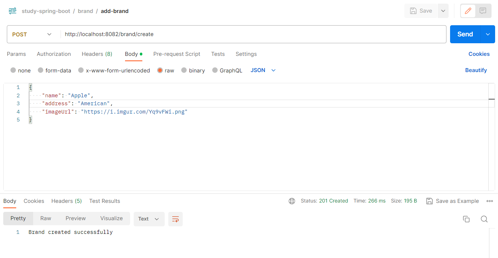

## Stage 1: Spring boot crud basic
### Structure project
- keyword: best structure package spring boot
```
com.example.myapp
├── config
├── controller
├── model/entity
├── dto
├── exception
├── repository
├── service
├── util
└── MyApplication.java
```

### Model
Đầu tiên ta tiến hành tạo tất cả các model và định nghĩa các quan hệ
giữa chúng từ bảng thiết kế class diagram.

Ví dụ tạo model Brand
```
package com.dev.studyspringboot.model;

import com.fasterxml.jackson.annotation.JsonIgnore;
import jakarta.annotation.Nullable;
import jakarta.persistence.*;
import lombok.*;

import java.time.LocalDateTime;
import java.util.List;

@Entity
@Data
@Builder
@NoArgsConstructor
@AllArgsConstructor
@Table(name = "brands")
public class Brand {
    @Id
    @GeneratedValue(strategy = GenerationType.IDENTITY)
    private Long id;
    private String name;
    private String address;
    private String imageUrl;
    private LocalDateTime createdAt;
    @Nullable
    private LocalDateTime updatedAt;
    @Nullable
    private LocalDateTime deletedAt;

    @JsonIgnore
    @OneToMany(mappedBy = "brand")
    private List<Product> products;

    @PrePersist
    public void prePersist() {
        if (createdAt == null) {
            createdAt = LocalDateTime.now();
        }
    }

    @PreUpdate
    public void preUpdate() {
        updatedAt = LocalDateTime.now();
    }
}
```
Chúng ta tạo các field cần thiết, sau đó thêm hai field LocalDateTime
createAt và updatedAt để lưu lại thời gian insert và update của data.

Các Annotation:

`@Entity`: Đánh dấu class Brand là entity, đồi tượng ánh xạ trực tiếp
với một bảng trong database.

`@Data`: Gồm `@Getter` và `@Setter`, tạo các getter, setter, toString, equals,
hashCode cho tất cả các fields.

`@Builder`: Tạo Builder Pattern cho Brand. Để hiểu rõ hơn bạn có thể tìm
hiểu về Builder Design Pattern.

`@NoArgsConstructor` và `@AllArgsConstructor`: Tạo constructor không có
tham số và có tất cả tham số.

`@Table(name = "brands")`: Xác định tên bảng trong database.

`@Id`: chỉ định primary key cho entity.

`@GeneratedValue(strategy = GenerationType.IDENTITY)`: định nghĩa id
tự động tăng.

Annotation `@PrePersist` chỉ định hàm prePersist() sẽ run trước khi insert
ta định nghĩa sẽ set time now().

Tương tự `@PreUpdate` sẽ run hàm preUpdate() khi data updated để cập nhật time.

`@OneToMany` là annotation chỉ liên kết 1 - * đến Product, mappedBy sẽ truyền
vào giá trị mà ta khai báo trong Product.

Tương tự ta tạo model Product
```
package com.dev.studyspringboot.model;

import com.dev.studyspringboot.util.enums.ProductType;
import com.fasterxml.jackson.annotation.JsonIgnore;
import jakarta.annotation.Nullable;
import jakarta.persistence.*;
import lombok.*;

import java.time.LocalDateTime;
import java.util.List;

@Entity
@Data
@Builder
@NoArgsConstructor
@AllArgsConstructor
@Table(name = "products")
public class Product {
    @Id
    @GeneratedValue(strategy = GenerationType.IDENTITY)
    private Long id;
    private String name;
    @Nullable
    private String screen;
    @Nullable
    private String cpu;
    @Nullable
    private String card;
    @Nullable
    private String ram;
    @Nullable
    private String rom;
    @Nullable
    private String pin;
    @Nullable
    private float weight;
    @Nullable
    private String os;
    @Nullable
    private String connector;
    private int price;
    private int salePrice;
    @Nullable
    private String special;
    private int yearLaunch;
    private String imageUrl;
    private String description;
    @Enumerated(EnumType.STRING)
    private ProductType productType;
    private LocalDateTime createdAt;
    private LocalDateTime updatedAt;
    @Nullable
    private LocalDateTime deletedAt;

    @ManyToOne()
    @JoinColumn(name = "brand_id")
    private Brand brand;
    @JsonIgnore
    @OneToMany(mappedBy = "product")
    private List<OrderProduct> orderProducts;
    @OneToMany(mappedBy = "product")
    private List<Feedback> feedbacks;

    @PrePersist
    public void prePersist() {
        if (createdAt == null) {
            createdAt = LocalDateTime.now();
        }
    }

    @PreUpdate
    public void preUpdate() {
        updatedAt = LocalDateTime.now();
    }
}
```
`@Nullable`: annotation định nghĩa cho phép null

`@ManyToOne()`: Định nghĩa nhiều Product thuộc 1 Brand

`@JoinColumn(name = "brand_id")`: Định nghĩa column khóa ngoại trong
database là brand_id

`@JsonIgnore`: Nếu trong quá trình định nghĩa các mối quan hệ trong các
model không sử dụng `fetch = FetchType.EAGER` thì khi query dữ liệu ví dụ
khi getOneProduct thì cũng sẽ get Data Brand, OrderProduct, Brand liên
quan đến product đó, vì vậy ta có thể sử dụng annotation này để loại bỏ
các data ta không mong muốn. Trong ví dụ này data orderProduct sẽ không
được get.

Một cách tiếp cận khác là fetch như ở trên, data chỉ khi get chỉ lấy với model
đó, không lấy các model khác, và chỉ lấy khi cần.
```
@OneToMany(mappedBy = "user", cascade = CascadeType.ALL, fetch = FetchType.EAGER)
private Set<UserRole> userRoles = new HashSet<>();
```

`@Enumerated(EnumType.STRING)`: chỉ định lưu enum là String trong database.

- productType có thể có nhiều loại: LAPTOP, SMARTPHONE, ....
- Ta sẽ tạo một package enum trong util lưu tất cả các enum sau này.

```
package com.dev.studyspringboot.util.enums;

public enum ProductType {
    LAPTOP,
    SMARTPHONE,
    TABLET,
    ACCESSORY
}
```

**Cuối cùng: Làm tương tự với các model khác dựa trên
class diagram đã thiết kế**

### Repository
Tạo interface BrandRepository trong package repository
```
package com.dev.studyspringboot.repository;

import com.dev.studyspringboot.model.Brand;
import org.springframework.data.jpa.repository.JpaRepository;
import org.springframework.data.jpa.repository.Modifying;
import org.springframework.data.jpa.repository.Query;
import org.springframework.data.repository.query.Param;
import org.springframework.stereotype.Repository;

import java.util.List;

@Repository
public interface BrandRepository extends JpaRepository<Brand, Long> {
    @Modifying
    @Query("UPDATE Brand b SET b.deletedAt = CURRENT_TIMESTAMP WHERE b.id = :brandId")
    void softDeleteById(@Param("brandId") Long brandId);

    List<Brand> findAllByDeletedAtIsNull();
    Brand findByIdAndDeletedAtIsNull(Long brandId);
}
```
Ở trong bài này ta sử dụng thư viện JPA để tương tác với database.

`@Repository`: đánh dấu lớp đó là Spring Data Repository

Sau đó ta các thể có được các hàm để tương tác với database như:

- `findAll()`: lấy toàn bộ data của entity (SELECT * FROM table_name).
- `findById()`: lấy data record tương ứng với id truyền vào (... WHERE id = ...)
- `save()`: lưu dữ liệu vào database (INSERT ...)
- `deleteById()`: xóa data record tương ứng với id truyền vào (DELETE ... WHERE id = ...)
- ...

Trong model của chúng ta, với cách thiết kế có field deletedAt thì nghĩa là
ta không muốn xóa hoàn toàn data mà chỉ cập nhật deletedAt (Xóa mềm). Vì vậy
ta cần phải sữa đổi một chút trong repository.

`@Modifying`: thông báo cho Spring Data JPA rằng phương thức này sẽ thay đổi
dữ liệu trong database. Annotation này cần kết hợp với `@Query`.

`@Query`: câu lệnh sql như bình thường.

Với sự thay đổi trên ta đã có các hàm khác như:

- `softDeleteById()`: Xóa mềm
- `findAllByDeletedAtIsNull()`: vẫn là lấy tất cả dữ liệu nhưng thêm điều kiện
  deletedAt = null.
- `findByIdAndDeletedAtIsNull()`: lấy thông tin record với id truyền vào
  và thõa deletedAt = null.

### Service
Tiếp theo, ta tiến hành tạo các file cần thiết trong package service

Đầu tiên ta tạo một interface IBrandService khai báo tất cả các hàm mà ta
cần thực hiện.
```
package com.dev.studyspringboot.service;

import com.dev.studyspringboot.model.Brand;

import java.util.List;

public interface IBrandService {
    void addBrand(Brand brand);
    void updateBrand(Long brandId, Brand brand);
    void deleteBrand(Long brandId);
    List<Brand> getAllBrand();
    Brand getOneBrand(Long brandId);
}
```

Sau đó ta tiến hành tạo một class BrandServiceImpl impliments interface ta vừa tạo.
```
package com.dev.studyspringboot.service;

import com.dev.studyspringboot.exception.NullException;
import com.dev.studyspringboot.exception.ResourceNotFoundException;
import com.dev.studyspringboot.model.Brand;
import com.dev.studyspringboot.repository.BrandRepository;
import com.dev.studyspringboot.util.ReflectionUtils;
import org.springframework.beans.factory.annotation.Autowired;
import org.springframework.stereotype.Service;
import org.springframework.transaction.annotation.Transactional;

import java.util.List;

@Service
public class BrandServiceImpl implements IBrandService{
    @Autowired
    private BrandRepository brandRepository;

    @Override
    public void addBrand(Brand brand) {
        if (brand != null) {
            brandRepository.save(brand);
        } else throw new NullException("Brand is null value!");
    }

    @Override
    public void updateBrand(Long brandId, Brand brand) {
        if (brand != null) {
            Brand existingBrand = brandRepository.findByIdAndDeletedAtIsNull(brandId);
            if (existingBrand != null) {
                ReflectionUtils.copyNonNullFields(brand, existingBrand);
                brandRepository.save(existingBrand);
            } else throw new ResourceNotFoundException("Brand has id: " + brandId + " NOT exist!");
        } else throw new NullException("Brand is null value!");
    }

    @Transactional
    @Override
    public void deleteBrand(Long brandId) {
        Brand brand = brandRepository.findByIdAndDeletedAtIsNull(brandId);
        if (brand != null) {
            brandRepository.softDeleteById(brandId);
        } else throw new ResourceNotFoundException("Brand has id: " + brandId + " NOT exist!");
    }

    @Override
    public List<Brand> getAllBrand() {
        return brandRepository.findAllByDeletedAtIsNull();
    }

    @Override
    public Brand getOneBrand(Long brandId) {
        Brand brand = brandRepository.findByIdAndDeletedAtIsNull(brandId);
        if (brand != null) {
            return brandRepository.findByIdAndDeletedAtIsNull(brandId);
        } else throw new ResourceNotFoundException("Brand has id: " + brandId + " NOT exist!");
    }
}
```

`@Service`: annotation Spring Framework đánh dấu một lớp là Spring Service

`@Autowired`:  annotation trong Spring Framework được sử dụng để thực hiện
việc tự động liên kết (autowiring) các dependency của một bean.

Ở đây ta khai báo một BrandRepository để sữ dụng được các hàm tương tác
với database.

Tiếp theo ta tiến hành code các hàm đã định nghĩa trong interface.

Các exception sẽ được trình bày trong mục **"Exception basic"** tại Stage 3

***addBrand()***
- Kiểm tra brand truyền vào nếu null trả ra NullException
- Gọi hàm save() lưu brand vào database

***updateBrand()***
- Kiểm tra brand truyền vào nếu null trả ra NullException
- Kiểm tra tồn tại Brand với id truyền vào, nếu null trả ra ResourceNotFoundException
- Copy các field not null trong brand truyền vào vào existingBrand

p/s: Viết hàm bổ trợ trong util
```
package com.dev.studyspringboot.util;

import java.lang.reflect.Field;

public class ReflectionUtils {
    public static void copyNonNullFields(Object source, Object target) {
        Field[] fields = source.getClass().getDeclaredFields();
        for (Field field : fields) {
            field.setAccessible(true);
            try {
                Object value = field.get(source);
                if (value != null) {
                    field.set(target, value);
                }
            } catch (IllegalAccessException e) {
                e.printStackTrace();
            }
        }
    }
}
```

- Gọi hàm save() lưu brand.

***deleteBrand()***
- Kiểm tra brand tồn tại
- softDelete brand

***getAllBrand()***
- Gọi hàm findAllByDeletedAtIsNull

***getOneBrand()***
- Kiểm tra brand tồn tại
- Gọi hàm findByIdAndDeletedAtIsNull

### Controller
Tiếp theo tạo BrandController trong package controller
```
package com.dev.studyspringboot.controller;

import com.dev.studyspringboot.model.Brand;
import com.dev.studyspringboot.service.IBrandService;
import org.springframework.beans.factory.annotation.Autowired;
import org.springframework.http.ResponseEntity;
import org.springframework.http.HttpStatus;
import org.springframework.validation.annotation.Validated;
import org.springframework.web.bind.annotation.*;

import java.util.List;

@RestController
@RequestMapping("/brand")
public class BrandController {
    @Autowired
    private IBrandService iBrandService;

    @PostMapping("/create")
    public ResponseEntity<String> addBrand(
            @Validated @RequestBody Brand brand )
    {
        iBrandService.addBrand(brand);
        return ResponseEntity.status(HttpStatus.CREATED).body("Brand created successfully");
    }

    @PutMapping("/update/{id}")
    public ResponseEntity<String> updateBrand(
            @PathVariable("id") Long brandId,
            @RequestBody Brand brand )
    {
        iBrandService.updateBrand(brandId, brand);
        return ResponseEntity.status(HttpStatus.OK).body("Brand updated successfully");
    }

    @PutMapping("/delete/{id}")
    public ResponseEntity<String> deleteBrand(
            @PathVariable("id") Long brandId )
    {
        iBrandService.deleteBrand(brandId);
        return ResponseEntity.status(HttpStatus.OK).body("Brand deleted successfully");
    }

    @GetMapping("/")
    public ResponseEntity<List<Brand>> getAllBrand()
    {
        List<Brand> brands = iBrandService.getAllBrand();
        return new ResponseEntity<>(brands, HttpStatus.OK);
    }

    @GetMapping("/show/{id}")
    public ResponseEntity<Brand> getOneBrand(
            @PathVariable("id") Long brandId )
    {
        Brand brand = iBrandService.getOneBrand(brandId);
        return new ResponseEntity<>(brand, HttpStatus.OK);
    }
}
```

`@RestController`: annotation Spring Framework đánh dấu một lớp controller.

`@RequestMapping("/brand")`: annotation trong Spring Framework được sử dụng
để ánh xạ một phương thức hoặc một lớp controller với một URL cụ thể

Định nghĩa IBrandService để sử dụng các hàm trong service

Tiến hành viết các api và trả về kết quả tương ứng.

`@PathVariable` : annotation thông báo lấy biền từ url

`@RequestBody `: annotation thông báo lấy brand từ body

Demo api with Postman

**create**


**update**


**delete**


**getAll**


**getOne**

