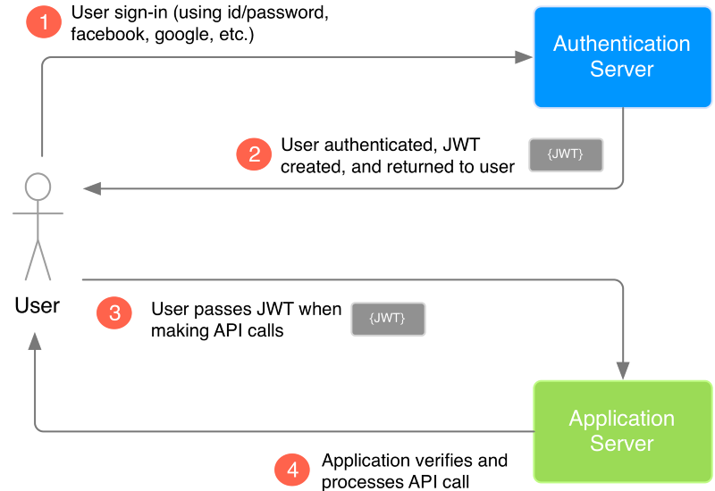
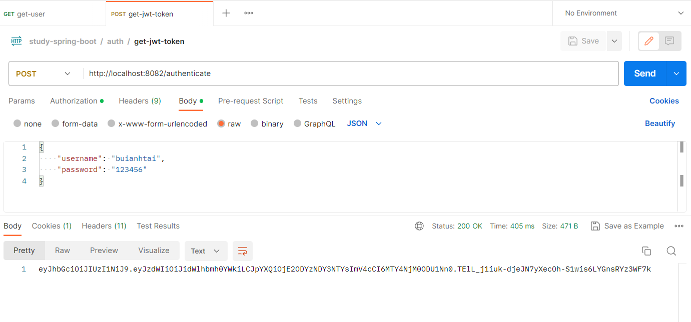
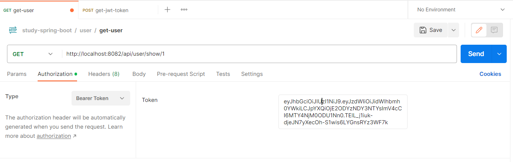
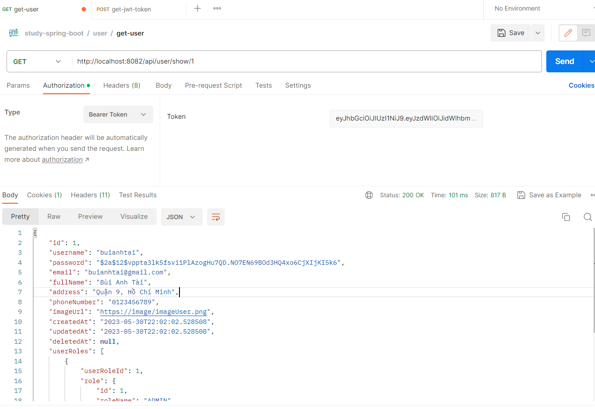
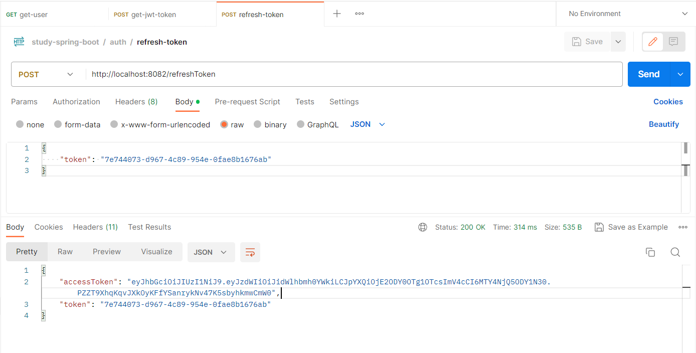

## Stage 2: Spring Security (Authentication, Authorization)
Trong ứng dụng này ta đang dùng Spring Boot 3 và Spring Security 6 nên có
khá nhiều thứ thay đổi.

Từ phiên bản hiện tại `WebSecurityConfigAdapter` không còn được Spring Boot hổ
trợ nữa.

Đầu tiên ta thêm dependence vào pom.xml
```
<dependency>
	<groupId>org.springframework.boot</groupId>
	<artifactId>spring-boot-starter-security</artifactId>
</dependency>
```
Đầu tiên ta tạo một class SecurityConfig trong package config.

Tiếp theo ta sẽ hard code tạo hai user và xử lý authentication cơ bản để hiểu
về authentication trước.
```
package com.dev.studyspringboot.config;

import org.springframework.context.annotation.Bean;
import org.springframework.context.annotation.Configuration;
import org.springframework.security.config.annotation.web.builders.HttpSecurity;
import org.springframework.security.config.annotation.web.configuration.EnableWebSecurity;
import org.springframework.security.core.userdetails.User;
import org.springframework.security.core.userdetails.UserDetails;
import org.springframework.security.core.userdetails.UserDetailsService;
import org.springframework.security.crypto.bcrypt.BCryptPasswordEncoder;
import org.springframework.security.crypto.password.PasswordEncoder;
import org.springframework.security.provisioning.InMemoryUserDetailsManager;
import org.springframework.security.web.SecurityFilterChain;


@Configuration
@EnableWebSecurity
public class SecurityConfig {
    @Bean
    // authentication
    public UserDetailsService userDetailsService(PasswordEncoder encoder) {
        UserDetails admin = User.withUsername("admin")
                .password(encoder.encode("admin"))
                .roles("ADMIN")
                .build();
        UserDetails user = User.withUsername("user")
                .password(encoder.encode("user"))
                .roles("USER")
                .build();
        return new InMemoryUserDetailsManager(admin, user);
    }
    @Bean
    public PasswordEncoder passwordEncoder() {
        return new BCryptPasswordEncoder();
    }

    @Bean
    public SecurityFilterChain securityFilterChain(HttpSecurity http) throws Exception {
        return http.csrf().disable()
                .authorizeHttpRequests()
                .requestMatchers("/hello").permitAll() // với endpoint /hello thì sẽ được cho qua
                .and()
                .authorizeHttpRequests()
                .requestMatchers("/user/**").authenticated() // với endpoint /customer/** sẽ yêu cầu authenticate
                .and().formLogin() // trả về page login nếu chưa authenticate
                .and().build();
    }
}
```
Ta run project để test, với /hello thì không cần login vẫn vào bình thường, còn
với các endpoint /user/** thì ta phải đăng nhập xác thực trước.

**Tài liệu tham khảo: https://viblo.asia/p/phan-1-spring-boot-30-va-spring-security-60-GAWVpdBYV05**

Tiếp theo ta sẽ phân quyền cho người dùng. Trước hết ta cần sữa lại controller
chi tiết hơn. Ta có thể tạo package admin trong controller để lưu các controller
xử lý bên admin.

Sau khi tạo lại các api, thì ta tiến hành phân quyền trong SecurityConfig
```
@Bean
    public SecurityFilterChain securityFilterChain(HttpSecurity http) throws Exception {
        return http.csrf().disable()
                .authorizeHttpRequests()
                .requestMatchers("/hello").permitAll() // với endpoint /hello thì sẽ được cho qua
                .and()
                .authorizeHttpRequests()
                .requestMatchers("api/admin/**").hasRole("ADMIN")
                .and()
                .authorizeHttpRequests()
                .requestMatchers("api/**").hasRole("USER")
                .and().formLogin() // trả về page login nếu chưa authenticate
                .and().httpBasic()
                .and().build();
    }
```

Với các api không cần xác thực login như `/hello` ta sẽ cho `permitAll()`.

Với các api có url `/admin` ta sẽ config has role ADMIN. Ngoài ra là USER.

Tuy nhiên đây chỉ là cơ bản về cách phân quyền, vì với user có các api như `/product/` , `/brand/`
thì không cần phải xác thực mà vẫn truy cập được. Vì vậy nếu làm cách này thì code của chúng ta
sẽ có thể rất dài nếu một trang web có 100 api trở lên. Tuy nhiên đối với các trang web đơn giản
thì cách làm này mang lại hiệu quả cao hơn, dễ config dễ đọc.

Đối với cách khác thì trong SecurityConfig ta sẽ bỏ đoạn config cho role USER.

Thay vào đó ta sẽ tự config role các api trong controller của user.

Đầu tiên ta cần một annotation trong file config `@EnableMethodSecurity`.

Các bạn cũng có thể đọc rõ hơn về phần này trên trang chủ của spring: https://docs.spring.io/spring-security/reference/servlet/authorization/method-security.html
```
@PreAuthorize("hasRole('USER')")
```
Ta có thể sử dụng annotation này ngày những api mà ta cần ROLE USER trong controller.
Tương tự với admin.

Các cách sử dụng `@PreAuthorize`:
- `@PreAuthorize("permitAll")`: api truy cập không cần xác thực, không cần login,
  áp dụng cho các api như lấy danh sách sản phẩm, chi tiết sản phẩm, đăng ký, đăng
  nhập,...
- `@PreAuthorize("denyAll")`: api chặn tất cả người dùng truy cập.
- `@PreAuthorize("hasRole('ADMIN')")`: api cho phép ADMIN truy cập
- `@PreAuthorize("hasAuthority('ROLE_ADMIN')")`: tương tự nhưng có prefix ROLE_
  trước role. Do được config mặc định như vậy, Khi sử dụng có thể
  Ctrl + Click vào để xem chi tiết
- ...

Tùy vào nhu cầu và các format quy ước chuẩn của dự án mà bạn có thể sử dụng
các cách trên.

Ví dụ với project hiện tại: Admin chỉ có admin được phép truy
cập nên mình sẽ config admin theo cách 1, còn với user mình sẽ sử dụng cách
2 vì trong user có nhiều api không cần xác thực vẫn có quyền truy cập.

Đầu tiên ta sẽ permitAll tất cả các url /**. Sau đó config /api/admin/** với
role ADMIN trên url. Còn với user như đã nói, ta sẽ dùng các annotation config
trực tiếp trong các method

```
@Bean
public SecurityFilterChain securityFilterChain(HttpSecurity http) throws Exception {
    return http.csrf().disable()
            .authorizeHttpRequests((authorize) -> authorize
                    .requestMatchers("/api/admin/**").hasRole("ADMIN")
                    .requestMatchers("/**").permitAll()
                    .anyRequest().authenticated()
            )
            .formLogin() // trả về page login nếu chưa authenticate
            .and().httpBasic()
            .and().build();
}
```

Trong UserController:
```
package com.dev.studyspringboot.controller;

import com.dev.studyspringboot.model.User;
import com.dev.studyspringboot.service.IUserService;
import org.springframework.beans.factory.annotation.Autowired;
import org.springframework.http.HttpStatus;
import org.springframework.http.ResponseEntity;
import org.springframework.security.access.prepost.PreAuthorize;
import org.springframework.validation.annotation.Validated;
import org.springframework.web.bind.annotation.*;

@RestController
@RequestMapping("/api/user")
public class UserController {
    @Autowired
    private IUserService iUserService;

    @PreAuthorize("permitAll")
    @PostMapping("/create")
    public ResponseEntity<String> addUser(
            @Validated @RequestBody User user )
    {
        iUserService.addUser(user);
        return ResponseEntity.status(HttpStatus.CREATED).body("User created successfully");
    }

    @PreAuthorize("hasRole('USER')")
    @PutMapping("/update/{id}")
    public ResponseEntity<String> updateUser(
            @PathVariable("id") Long userId,
            @RequestBody User user )
    {
        iUserService.updateUser(userId, user);
        return ResponseEntity.status(HttpStatus.OK).body("User updated successfully");
    }

    @PreAuthorize("hasRole('USER')")
    @PutMapping("/delete/{id}")
    public ResponseEntity<String> deleteUser(
            @PathVariable("id") Long userId )
    {
        iUserService.deleteUser(userId);
        return ResponseEntity.status(HttpStatus.OK).body("User deleted successfully");
    }

    @PreAuthorize("hasRole('USER')")
    @GetMapping("/show/{id}")
    public ResponseEntity<User> getOneUser(
            @PathVariable("id") Long userId )
    {
        User user = iUserService.getOneUser(userId);
        return new ResponseEntity<>(user, HttpStatus.OK);
    }
}
```

**Phần tiếp theo ta sẽ quay lại về authentication. Sau khi đã phân quyền mọi thứ
ta cần sửa đổi phần hard code ta tạo sẵn lúc trước. Ta sẽ config để lấy account
và roles trong database để xác thực vào hệ thống.**

Đầu tiên ta sẽ config lại một chút các model User, Role, UserRole để có thề thực hiện
authentication. **Xem commit config model to authorization 08/06/2023**

Đâu tiên ta thấy trong config của chúng ta đang sử dụng `UserDetailsService` mặc định
của spring security. Ta sẽ tạo một class `CustomUserDetailsService` implements `UserDetailsService`.

Ta sẽ return class ta tạo trong config của ta.
```
// authentication
@Bean
public UserDetailsService userDetailsService() {
    return new CustomUserDetailService();
}
```

Tiếp đến ta tiến hành override lại các method của `UserDetailsService` trong `CustomUserDetailsService`
và tiến hành sửa đổi theo database của ta.
```
package com.dev.studyspringboot.config;

import com.dev.studyspringboot.model.User;
import com.dev.studyspringboot.repository.UserRepository;
import org.springframework.beans.factory.annotation.Autowired;
import org.springframework.security.core.userdetails.UserDetails;
import org.springframework.security.core.userdetails.UserDetailsService;
import org.springframework.security.core.userdetails.UsernameNotFoundException;
import org.springframework.stereotype.Component;

import java.util.Optional;

@Component
public class CustomUserDetailService implements UserDetailsService {
    @Autowired
    private UserRepository userRepository;

    @Override
    public UserDetails loadUserByUsername(String username) throws UsernameNotFoundException {
        Optional<User> user = userRepository.findUserAndRoleToLogin(username);
        return user.map(CustomUserDetails::new)
                .orElseThrow(() -> new UsernameNotFoundException("User not found" + username));
    }
}
```
Tại đây ta cần sử dụng userRepository, ta viết một hàm để lấy thông tin user và các quyền của user
```
@Query("SELECT u " +
            "FROM User u " +
            "LEFT JOIN FETCH u.userRoles ur " +
            "LEFT JOIN FETCH ur.role r " +
            "WHERE u.username = :username AND u.deletedAt is NULL")
Optional<User> findUserAndRoleToLogin(String username);
```
kết quả của hàm này sẽ trả về:
```
{
    "id": 1,
    "username": "buianhtai",
    "password": "$2a$12$vppta3lk5fsvi1PlAzogHu7QD.NO7EN69BOd3HQ4xo6CjXIjKI5k6",
    "email": "buianhtai@gmail.com",
    "fullName": "Bùi Anh Tài",
    "address": "Quận 9, Hồ Chí Minh",
    "phoneNumber": "0123456789",
    "imageUrl": "https://image/imageUser.png",
    "createdAt": "2023-05-30T22:02:02.528508",
    "updatedAt": "2023-05-30T22:02:02.528508",
    "deletedAt": null,
    "userRoles": [
        {
            "userRoleId": 2,
            "role": {
                "id": 2,
                "roleName": "USER"
            }
        },
        {
            "userRoleId": 1,
            "role": {
                "id": 1,
                "roleName": "ADMIN"
            }
        }
    ]
}
```
Oke,giờ ta đã có dữ liệu, tiếp theo ta sẽ lại tiếp tục custom để đưa các quyền của trong database của ta vào hệ thống.
Trong hàm custom trên chỉ có 1 phương thức loadUserByUsername trả về là một UserDetails. ta sẽ custom lại nốt UserDetails.

Ta tạo class `CustomUserDetails` implements `UserDetails`. Sau đó override tất cả các hàm của lớp `UserDetails`.

Tại đây ta đọc các hàm mặc định `getAuthorities()`, `getUsername()`, `getPassword()`,... ta sẽ thêm các properties vào
class sau đó tạo constructor nhận thông tin user ta lấy được từ class trước sau đó gán cho các hàm này của hệ thống.
Ngoài ra với 4 hàm boolean check phía dưới ta s auto trả về true, để chạy theo đơn giản, các hàm đó khi ta nâng cấp
chức năng ta sẽ tiến hành config điều kiện lại sau.
```
package com.dev.studyspringboot.config;

import com.dev.studyspringboot.model.User;
import org.springframework.security.core.GrantedAuthority;
import org.springframework.security.core.authority.SimpleGrantedAuthority;
import org.springframework.security.core.userdetails.UserDetails;

import java.util.Collection;
import java.util.List;
import java.util.stream.Collectors;

public class CustomUserDetails implements UserDetails {

    private final String username;
    private final String password;
    private final List<GrantedAuthority> authorities;

    public CustomUserDetails(User user) {
        username = user.getUsername();
        password = user.getPassword();
        authorities = user.getUserRoles().stream()
                .map(userRole -> {
                    String roleName = "ROLE_" + userRole.getRole().getRoleName();
                    return new SimpleGrantedAuthority(roleName);
                })
                .collect(Collectors.toList());
    }

    @Override
    public Collection<? extends GrantedAuthority> getAuthorities() {
        return this.authorities;
    }

    @Override
    public String getPassword() {
        return this.password;
    }

    @Override
    public String getUsername() {
        return this.username;
    }

    @Override
    public boolean isAccountNonExpired() {
        return true;
    }

    @Override
    public boolean isAccountNonLocked() {
        return true;
    }

    @Override
    public boolean isCredentialsNonExpired() {
        return true;
    }

    @Override
    public boolean isEnabled() {
        return true;
    }
}
```
Trong đoạn code set authorities ta phải thêm tiền tố `ROLE_` phía trước vì đây là config mặc định của spring security,
mình đã đề cập vấn đề này ở trước. `authority = ROLE_ + role`. nếu dùng hasRole thì không cần tiền tố nhưng has Authority
thì phải có.

Đến đây việc custom lại các class đã xong, nếu bạn test ngay lúc này thì giao diện sẽ hiển thị một lỗi Không có `AuthenticationProvider`.
Ta sẽ quay lại file config và thêm một đoạn config `AuthenticationProvider`.
```
@Bean
public AuthenticationProvider authenticationProvider() {
    DaoAuthenticationProvider authenticationProvider = new DaoAuthenticationProvider();
    authenticationProvider.setUserDetailsService(userDetailsService());
    authenticationProvider.setPasswordEncoder(passwordEncoder());
    return authenticationProvider;
}
```
Oke. tới đây thì mọi thứ đã chạy tốt. Nếu muốn tìm hiểu rõ hơn thì link mình tham khảo mình để bên dưới.

**Phần authentication này mình tham khảo tại video: https://www.youtube.com/watch?v=R76S0tfv36w**

Trong các phần tiếp theo của Security ta sẽ tìm hiểu và làm JWT và Oauth2.

### JWT - Json Web Token
Đầu tiên, ta sẽ tìm hiểu tại sao cần nó.

Hiện tại hệ thống ta đang làm đang xác thực bằng JSESSSIONID để định danh một người dùng.

Session của user sẽ được lưu tại file or database.

Khi user request đến server, request kèm theo jsessionid trong header.

Sau đó authentication server sẽ so sánh đề kiểm tra trạng thái xác thực.

Về tính mờ rộng (Scalability): Khi hệ thống của ta lớn lên, ta phải cần một session service
để lưu các session. Tất nhiên điều này tốn chi phí.

→ Nếu sử dụng JWT thì sao. JWT là một chuổi token và được lưu trong storage, khi request
sẽ kèm theo trong Authorization, ta chỉ cần lấy nó và so sánh để xác thực. JWT Không cần
lưu trong database nên sẽ không tốn thêm chi phí. Tuy nhiên, vấn đề của nó là dung lượng
gấp nhiều lần so với jsessionid

Về tình bảo mật (Security): gần như cả hai cách trên đều giống nhau, khi bị người khác
biết jsessionid hoặc jwt thì gần như người đó có thể truy cập vào hệ thống. Tất nhiên
jwt có thể hạn chế bớt bằng cách rút ngắn expiration date. Tuy nhiên giải pháp tốt nhất
cho hai cách trên vẫn là SSL để đảm bảo các thông tin trong request được encrypt.

Về hiệu suất (performance): Như đã nói ban đầu, JWT sẽ tốt hơn về mặt hiệu năng do chỉ
cần kiểm tra Signature và 1 số thông tin trong claims là đủ. Trong khi jsessionid thì
phải truy vấn đến server (và điều này không hề miễn phí). Với một trang React/Angular với
100 component thực hiện request đến server, mỗi request đều cần xác thực thì lượng kinh
tế tiêu tốn theo thời gian sẽ quá nhiều.

→ Đó chính là các lý do mà ta cần JWT.

**Tài liệu mình tham khảo tại: https://viblo.asia/p/jwt-tu-co-ban-den-chi-tiet-LzD5dXwe5jY#_414-performance-17**

Tiếp theo ta sẽ tiến hành config JWT cho hệ thống.

Đầu tiên ta sẽ thêm một số dependence vào pom.xml
```
<dependency>
	<groupId>io.jsonwebtoken</groupId>
	<artifactId>jjwt-api</artifactId>
	<version>0.11.5</version>
</dependency>
<dependency>
	<groupId>io.jsonwebtoken</groupId>
	<artifactId>jjwt-impl</artifactId>
	<version>0.11.5</version>
</dependency>
<dependency>
	<groupId>io.jsonwebtoken</groupId>
	<artifactId>jjwt-jackson</artifactId>
	<version>0.11.5</version>
</dependency>
```
Ta sẽ sửa lại package config, ta tạo trong config hai package `jwt`(chứa các config jwt)
và `service`(chứa các custom ta implements lại từ Spring) sau đó đưa các custom trước
của chúng ta vào `services`.

Trong `jwt` ta tạo một class JwtService chứa tất cả các hàm sử lý jwt.
```
package com.dev.studyspringboot.config.jwt;

import io.jsonwebtoken.Claims;
import io.jsonwebtoken.Jwts;
import io.jsonwebtoken.SignatureAlgorithm;
import io.jsonwebtoken.io.Decoders;
import io.jsonwebtoken.security.Keys;
import org.springframework.security.core.userdetails.UserDetails;
import org.springframework.stereotype.Component;

import java.security.Key;
import java.util.Date;
import java.util.HashMap;
import java.util.Map;
import java.util.function.Function;

@Component
public class JwtService {
    private static final String SECRET = "5367566B59703373367639792F423F4528482B4D6251655468576D5A71347437";

    public String generateToken(String username) {
        Map<String, Object> claims = new HashMap<>();
        return createToken(claims, username);
    }

    private String createToken(Map<String, Object> claims, String username) {
        return Jwts.builder()
                .setClaims(claims)
                .setSubject(username)
                .setIssuedAt(new Date(System.currentTimeMillis()))
                .setExpiration(new Date(System.currentTimeMillis() + 1000*60*30))
                .signWith(getSignKey(), SignatureAlgorithm.HS256).compact();
    }

    private Key getSignKey() {
        byte[] keyBytes = Decoders.BASE64.decode(SECRET);
        return Keys.hmacShaKeyFor(keyBytes);
    }
}
```
Ta có một hàm generateToken nhận tham số username từ request.

Hàm createToken sẽ tiến hành tạo một JWT.

Chúng ta sẽ chọn một SECRET khó để làm SignKey.

Tiếp theo trong `controller` ta thêm một package `auth` xử lý các vấn đề xác thực.
Ta tạo một AuthController
```
package com.dev.studyspringboot.controller.auth;

import com.dev.studyspringboot.config.services.CustomAuthenticationManager;
import com.dev.studyspringboot.dto.AuthRequest;
import com.dev.studyspringboot.config.jwt.JwtService;
import org.springframework.beans.factory.annotation.Autowired;
import org.springframework.http.HttpStatus;
import org.springframework.http.ResponseEntity;
import org.springframework.security.authentication.UsernamePasswordAuthenticationToken;
import org.springframework.security.core.Authentication;
import org.springframework.web.bind.annotation.PostMapping;
import org.springframework.web.bind.annotation.RequestBody;
import org.springframework.web.bind.annotation.RestController;

@RestController
public class AuthController {
    @Autowired
    private JwtService jwtService;

    @PostMapping("/authenticate")
    public ResponseEntity<?> authenticateAndGetJwt(@RequestBody AuthRequest authRequest )
    {
         return ResponseEntity.ok(jwtService.generateToken(authRequest.getUsername()));
    }
}
```
Tại đây ta tạo thêm một package `dto`(Data Transfer Object). Mục đích của package này
sẽ được hiễu rõ hơn ở phần sau.

Ta tạo một AuthRequest chứa thông tin request login.
```
package com.dev.studyspringboot.dto;

import lombok.AllArgsConstructor;
import lombok.Data;
import lombok.NoArgsConstructor;

@Data
@AllArgsConstructor
@NoArgsConstructor
public class AuthRequest {
    private String username;
    private String password;
}
```

Giờ đây ta có thể vào Postman test api này, Ta cần truyền vào request body username, password

Hệ thống sẽ trả về cho ta một JWT. Tuy nhiên nếu bạn thử ngồi thay đổi password hay username
không tồn tại trong hệ thống thì nó vẫn trả về được. Ta cần phải xác thực thông tin
nhận được từ request với database trước khi tạo JWT.

Chúng ta sẽ sử dụng một Interface `AuthenticationManager` để làm điều đó. Đến đây có hai
cách để thực hiện:
- Cách 1: Config nó vào `SecurityConfig` của chúng ta để sử dụng mặc định của hệ thống.
  (Theo những gì mình tìm hiểu thì điều này không tốt)
- Cách 2: Ta sẽ tạo một `CustomAuthenticationManager` implements `AuthenticationManager`, giống
  như cách chúng ta đẽ làm với các phần trước.

Ta sẽ tạo một CustomAuthenticationManager trong package `config/services`
```
package com.dev.studyspringboot.config.services;

import org.springframework.beans.factory.annotation.Autowired;
import org.springframework.security.authentication.AuthenticationManager;
import org.springframework.security.authentication.BadCredentialsException;
import org.springframework.security.authentication.UsernamePasswordAuthenticationToken;
import org.springframework.security.core.Authentication;
import org.springframework.security.core.AuthenticationException;
import org.springframework.security.core.userdetails.UserDetails;
import org.springframework.security.crypto.bcrypt.BCryptPasswordEncoder;
import org.springframework.stereotype.Component;

@Component
public class CustomAuthenticationManager implements AuthenticationManager {
    @Autowired
    private CustomUserDetailService customUserDetailsService;

    @Override
    public Authentication authenticate(Authentication authentication) throws AuthenticationException {
        final UserDetails userDetail = customUserDetailsService.loadUserByUsername(authentication.getName());
        if (!new BCryptPasswordEncoder().matches(authentication.getCredentials().toString(), userDetail.getPassword())) {
            throw new BadCredentialsException("Wrong password!");
        }
        return new UsernamePasswordAuthenticationToken(userDetail.getUsername(), userDetail.getPassword(), userDetail.getAuthorities());
    }
}
```
Mình làm cách này vì mình thích tùy biến các hàm theo ý muốn, và cũng để phần sau tự làm các exception cho chỉnh chu.

Oke, sau khí đả tạo xong class trên ta sẽ quay lại `AuthController` để thay đổi nó
```
@PostMapping("/authenticate")
public ResponseEntity<?> authenticateAndGetJwt(@RequestBody AuthRequest authRequest )
{
    Authentication authentication = authenticationManager
            .authenticate(new UsernamePasswordAuthenticationToken(
            authRequest.getUsername(),
            authRequest.getPassword()
    ));
    if (authentication.isAuthenticated()) {
        return ResponseEntity.ok(jwtService.generateToken(authRequest.getUsername()));
    }
    return ResponseEntity.status(HttpStatus.INTERNAL_SERVER_ERROR).build();
}
```
Sau khi test lại với api thì mọi thứ đã oke hơn, hệ thống sẽ báo wrong password nếu nhập sai, và user not found
nếu không có database (Phần exception tạm thời làm vậy, Vào Stage Exception mình sẽ quay lại config kỷ hơn)

Oke, tiếp theo ta sẽ tiến hành thêm nó vào config để khi test api, ta sẽ nhập JWT vào Authorization Bearer Token
ta có thể xác thực và phân quyền để request đến server.



Ta sẽ quay lại `JwtService` để viết thêm một số hàm extract để thấy các thông tin username, claims.
```
package com.dev.studyspringboot.config.jwt;

import io.jsonwebtoken.Claims;
import io.jsonwebtoken.Jwts;
import io.jsonwebtoken.SignatureAlgorithm;
import io.jsonwebtoken.io.Decoders;
import io.jsonwebtoken.security.Keys;
import org.springframework.security.core.userdetails.UserDetails;
import org.springframework.stereotype.Component;

import java.security.Key;
import java.util.Date;
import java.util.HashMap;
import java.util.Map;
import java.util.function.Function;

@Component
public class JwtService {
    private static final String SECRET = "5367566B59703373367639792F423F4528482B4D6251655468576D5A71347437";

    public String extractUsername(String token) {
        return extractClaim(token, Claims::getSubject);
    }

    public Date extractExpiration(String token) {
        return extractClaim(token, Claims::getExpiration);
    }

    public <T> T extractClaim(String token, Function<Claims, T> claimsResolver) {
        final Claims claims = extractAllClaims(token);
        return claimsResolver.apply(claims);
    }

    private Claims extractAllClaims(String token) {
        return Jwts
                .parserBuilder()
                .setSigningKey(getSignKey())
                .build()
                .parseClaimsJws(token)
                .getBody();
    }

    private Boolean isTokenExpired(String token) {
        return extractExpiration(token).before(new Date());
    }

    public Boolean validateToken(String token, UserDetails userDetails) {
        final String username = extractUsername(token);
        return (username.equals(userDetails.getUsername()) && !isTokenExpired(token));
    }

    public String generateToken(String username) {
        Map<String, Object> claims = new HashMap<>();
        return createToken(claims, username);
    }

    private String createToken(Map<String, Object> claims, String username) {
        return Jwts.builder()
                .setClaims(claims)
                .setSubject(username)
                .setIssuedAt(new Date(System.currentTimeMillis()))
                .setExpiration(new Date(System.currentTimeMillis() + 1000*60*30))
                .signWith(getSignKey(), SignatureAlgorithm.HS256).compact();
    }

    private Key getSignKey() {
        byte[] keyBytes = Decoders.BASE64.decode(SECRET);
        return Keys.hmacShaKeyFor(keyBytes);
    }
}
```
3 hàm đầu là các hàm lấy thông tin từ token, 2 hàm sau là các hàm kiểm tra hạn của token.

Tiếp theo ta tạo một file `JwtAuthFilter` trong `config/jwt`
```
package com.dev.studyspringboot.config.jwt;

import com.dev.studyspringboot.config.services.CustomUserDetailService;
import jakarta.servlet.FilterChain;
import jakarta.servlet.ServletException;
import jakarta.servlet.http.HttpServletRequest;
import jakarta.servlet.http.HttpServletResponse;
import org.springframework.beans.factory.annotation.Autowired;
import org.springframework.security.authentication.UsernamePasswordAuthenticationToken;
import org.springframework.security.core.context.SecurityContextHolder;
import org.springframework.security.core.userdetails.UserDetails;
import org.springframework.security.web.authentication.WebAuthenticationDetailsSource;
import org.springframework.stereotype.Component;
import org.springframework.web.filter.OncePerRequestFilter;

import java.io.IOException;

@Component
public class JwtAuthFilter extends OncePerRequestFilter {
    @Autowired
    private JwtService jwtService;
    @Autowired
    private CustomUserDetailService customUserDetailService;

    @Override
    protected void doFilterInternal(HttpServletRequest request,
                                    HttpServletResponse response,
                                    FilterChain filterChain )
            throws ServletException, IOException
    {
        String authHeader = request.getHeader("Authorization");
        String token = null;
        String username = null;

        if (authHeader != null && authHeader.startsWith("Bearer ")) {
            token = authHeader.substring(7);
            username = jwtService.extractUsername(token);
        }

        if (username != null && SecurityContextHolder.getContext().getAuthentication() == null) {
            UserDetails userDetails = customUserDetailService.loadUserByUsername(username);

            if (jwtService.validateToken(token, userDetails)) {
                UsernamePasswordAuthenticationToken authToken = new UsernamePasswordAuthenticationToken(
                        userDetails,
                        null,
                        userDetails.getAuthorities()
                );
                authToken.setDetails(new WebAuthenticationDetailsSource().buildDetails(request));
                SecurityContextHolder.getContext().setAuthentication(authToken);
            }
        }

        filterChain.doFilter(request, response);
    }
}
```
Class này sẽ implements OncePerRequestFilter, sau đó ta tiến hành override lại phương thức `doFilterInternal()`,

Tiếp theo ta quay lại file config gốc để thêm filter vào http
```
public class SecurityConfig {
    @Autowired
    private JwtAuthFilter jwtAuthFilter;

    // authentication
    @Bean
    public UserDetailsService userDetailsService() {
        return new CustomUserDetailService();
    }

    //authorization
    @Bean
    public SecurityFilterChain securityFilterChain(HttpSecurity http) throws Exception {
        return http.csrf().disable()
                .authorizeHttpRequests((authorize) -> authorize
                        .requestMatchers("api/admin/**").hasRole("ADMIN")
                        .requestMatchers("/**").permitAll()
                        .anyRequest().authenticated()
                )
                .sessionManagement()
                .sessionCreationPolicy(SessionCreationPolicy.STATELESS)
                .and().authenticationProvider(authenticationProvider())
                .addFilterBefore(jwtAuthFilter, UsernamePasswordAuthenticationFilter.class)
                .build();
    }
    ...    
}
```
Đến đây thì mọi thứ đã hoàn tất. Ta có thể test trực tiếp với Postman

Ta sẽ lấy JWT trước:



Sau đó ta vào một api cần login và role để test, ta sẽ thêm JWT vào Authorization Bearer Token



Và đây là kết quả



**Link video mình tham khảo: https://www.youtube.com/watch?v=NcLtLZqGu2M**

### Refresh Token
Trong phần trước ta đã tạo JWT, nhưng expiryDate của nó ta đang tạo thời gian 30p.
Việc làm như vậy, mang mục đích lở có bị khai thác và lộ JWT thì nếu nó còn hạn thì
quá nguy hiểm, vì vậy ta phải refresh jwt thường xuyên để hạn chế vấn đề này.

Tuy nhiên, với một ứng dụng web application, nếu bạn là người dùng, cứ 30p là bạn
phải sign in lại mới có thể su73 dụng trang web thi bạn có thấy khó chịu không. Vì
vậy ta cần tạo refreshToken để giải quyết vấn đề này.

Ta sẽ tạo thêm một refreshToken cho mỗi user, khi user login, ta tạo và lưu một refreshToken
. Khi JWT hết hạn, ta có thể không yêu cầu người dùng sign in lại. Ta chỉ cần phía front-end
gửi refreshToken thì server sẽ tạo lại JWT và gừi lại bên front-end.

Đầu tiên ta tạo model RefreshToken, chứa `token`, `expiryDate` (hạn mình cho là 10 ngày, sau 10
ngày thì user phải sign in lại chứ không refresh jwt được nữa. Tùy vào trang web của các
bạn mà các bạn cấu hình) , `OneToOne User`.
```
package com.dev.studyspringboot.model;

import jakarta.persistence.*;
import lombok.AllArgsConstructor;
import lombok.Builder;
import lombok.Data;
import lombok.NoArgsConstructor;

import java.time.Instant;

@Entity
@Data
@Builder
@NoArgsConstructor
@AllArgsConstructor
public class RefreshToken {
    @Id
    @GeneratedValue(strategy = GenerationType.IDENTITY)
    private Long id;
    private String token;
    private Instant expiryDate;
    @OneToOne
    @JoinColumn(name = "user_id", referencedColumnName = "id")
    private User user;
}
```
Tiếp theo như các model khác ta sẽ tạo Repository, và Service

Sau đó trong service ta sử lý `createRefreshToken(String username)`
```
package com.dev.studyspringboot.service;

import com.dev.studyspringboot.model.RefreshToken;
import com.dev.studyspringboot.repository.RefreshTokenRepository;
import com.dev.studyspringboot.repository.UserRepository;
import org.springframework.beans.factory.annotation.Autowired;
import org.springframework.stereotype.Service;

import java.time.Instant;
import java.util.Optional;
import java.util.UUID;

@Service
public class RefreshTokenServiceImpl implements IRefreshTokenService{
    @Autowired
    private RefreshTokenRepository refreshTokenRepository;
    @Autowired
    private UserRepository userRepository;

    @Override
    public RefreshToken createRefreshToken(String username) {
        RefreshToken refreshToken = RefreshToken.builder()
                .token(UUID.randomUUID().toString())
                .expiryDate(Instant.now().plusSeconds(86400*10)) // 10 days
                .user(userRepository.findByUsernameAndDeletedAtIsNull(username))
                .build();
        return refreshTokenRepository.save(refreshToken);
    }

    @Override
    public Optional<RefreshToken> findByToken(String token) {
        return refreshTokenRepository.findByToken(token);
    }

    @Override
    public RefreshToken verifyExpiration(RefreshToken token) {
        if (token.getExpiryDate().compareTo(Instant.now()) < 0) {
            refreshTokenRepository.delete(token);
            throw new RuntimeException(token.getToken() + " . RefreshToken was expired. Please make new sign in!");
        }
        return token;
    }
}
```
Oke, bây giờ quay lại `AuthController`, ta cần làm hai việc, ta thay đổi một chút ở sign in,
Khi sign in ngoài generate JWT ta cần tạo RefreshToken
```
@PostMapping("/authenticate")
public ResponseEntity<?> authenticateAndGetJwt(@RequestBody AuthRequest authRequest )
{
    Authentication authentication = authenticationManager
            .authenticate(new UsernamePasswordAuthenticationToken(
            authRequest.getUsername(),
            authRequest.getPassword()
    ));
    if (authentication.isAuthenticated()) {
        RefreshToken refreshToken = refreshTokenService.createRefreshToken(authRequest.getUsername());
        JwtResponse jwtResponse = JwtResponse.builder()
                .accessToken(jwtService.generateToken(authRequest.getUsername()))
                .token(refreshToken.getToken())
                .build();
        return ResponseEntity.ok(jwtResponse);
    }
    return ResponseEntity.status(HttpStatus.INTERNAL_SERVER_ERROR).build();
}
```
Trong hàm trên mình có tạo thêm `dto/JwtResponse` bao jwt và refreshToken trả về front-end
```
package com.dev.studyspringboot.dto;

import lombok.AllArgsConstructor;
import lombok.Builder;
import lombok.Data;
import lombok.NoArgsConstructor;

@Data
@AllArgsConstructor
@NoArgsConstructor
@Builder
public class JwtResponse {
    private String accessToken;
    private String token;
}
```
Sau đó ta viết thêm một request POST refreshToken để refresh jwt
```
@PostMapping("/refreshToken")
public JwtResponse refreshToken(@RequestBody RefreshTokenRequest refreshTokenRequest) {
    return refreshTokenService.findByToken(refreshTokenRequest.getToken())
            .map(refreshTokenService::verifyExpiration)
            .map(RefreshToken::getUser)
            .map(user -> {
                String accessToken = jwtService.generateToken(user.getUsername());
                return JwtResponse.builder()
                        .accessToken(accessToken)
                        .token(refreshTokenRequest.getToken())
                        .build();
            }).orElseThrow(() -> new RuntimeException("Refresh token is not in database"));
}
```
Trong hàm trên `RefreshTokenRequest` được tạo trong dto, chỉ có 1 field String token.

Front-end sẽ gửi token về phía server, server sẽ truy vấn database xem có tồn tại token
trong table refresh_token không, và kiểm tra expirydate của nó. Sau đó nếu hợp lệ sẽ
tạo lại jwt và gừi về front-end.

